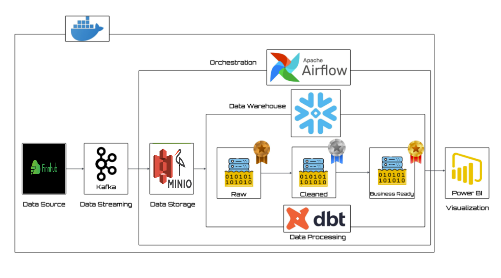
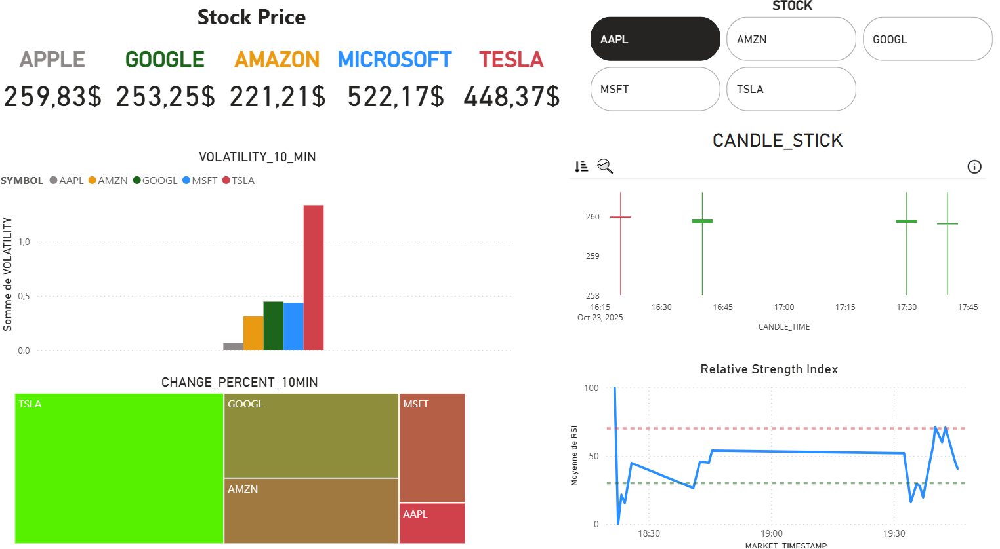

---

📌 Présentation du projet

Ce projet met en œuvre une pipeline de données temps réel de bout en bout basée sur la Modern Data Stack.
Il capture les données boursières en direct depuis une API externe, les diffuse en temps réel, orchestre les transformations, et produit des informations prêtes pour l’analyse — le tout dans un projet unifié.

⚡ Stack technologique

Python → Récupération de données et intégration API Finhub

Apache Kafka → Streaming temps réel

minio → Data lake

Snowflake → Entrepôt de données cloud

DBT → Transformations SQL

Apache Airflow → Orchestration de workflows

Power BI → Visualisation des données

Docker → Conteneurisation

✅ Fonctionnalités principales

Récupération de données boursières réelles (non simulées) depuis une API.

Pipeline de streaming temps réel avec Kafka pour la collecte continue des cotations.

Workflow ETL automatisé et orchestré avec Apache Airflow.

Transformations de données gérées et versionnées avec DBT dans Snowflake.

Architecture scalable et modulaire basée sur Snowflake pour la gestion des données.

Tableau de bord Power BI entièrement connecté en DirectQuery pour une analyse dynamique.

📊 Ce que permet le Dashboard Power BI

Le tableau de bord offre une vue en temps réel des marchés boursiers à travers plusieurs indicateurs :

Prix actuel par stock (AAPL, MSFT, AMZN, GOOGL, TSLA).

Volatilité moyenne sur 10 minutes, pour évaluer l’instabilité des prix.

Évolution du prix en pourcentage (Heatmap) pour repérer rapidement les actions en hausse ou en baisse.

Graphique en chandeliers (Candle Stick) (10 minutes) montrant les tendances.

Indice RSI (Relative Strength Index) indiquant les zones de surachat ou de survente pour chaque titre.

💡 En résumé, ce dashboard permet un suivi complet et en direct de la performance des principales actions, tout en facilitant la prise de décision financière rapide et éclairée.

